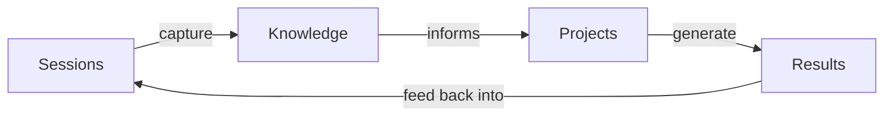
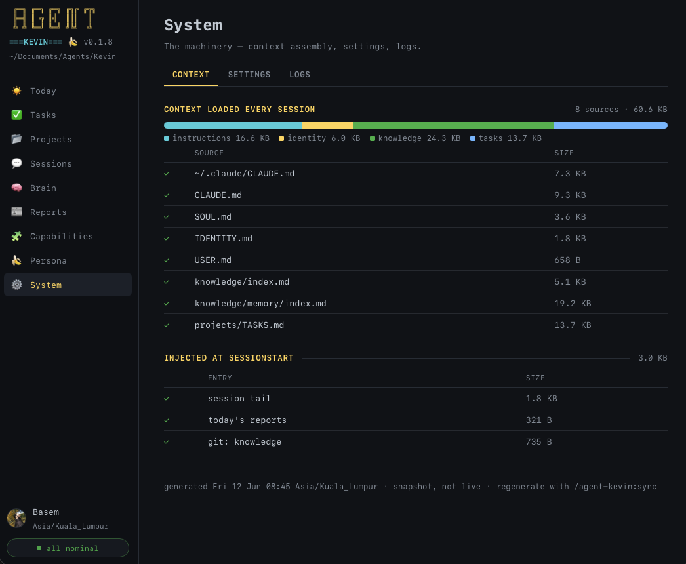
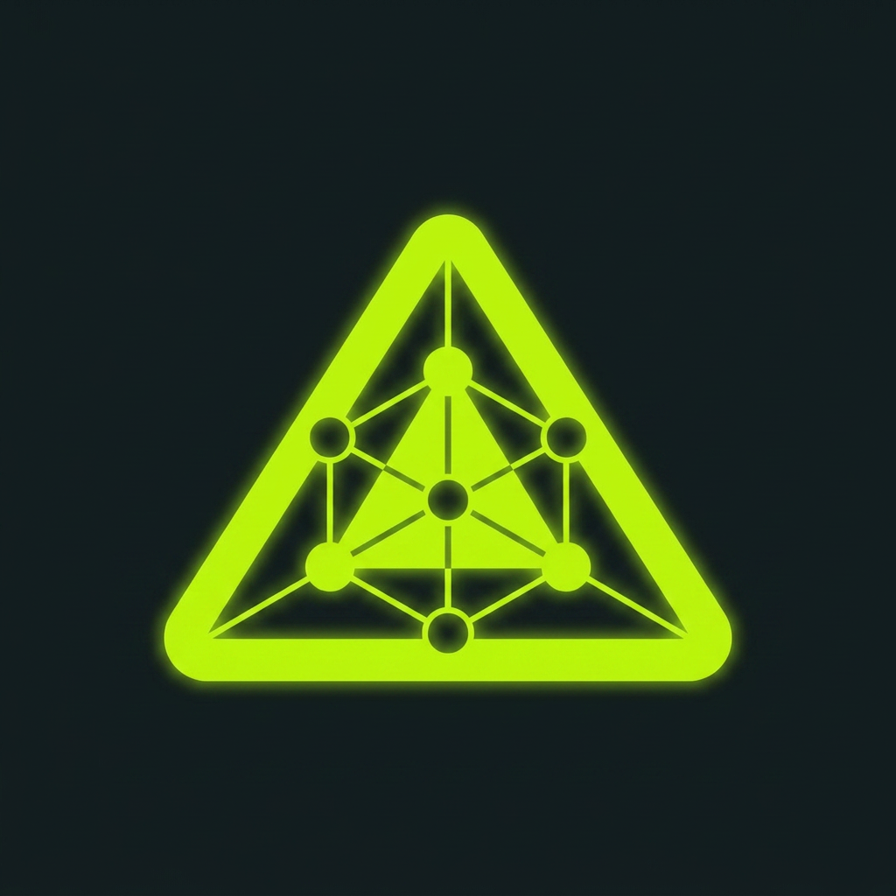

<div align="center">


# Agent Kevin 🍌

**Your personal AI assistant, as a Claude Code or Codex plugin.**
One markdown folder, one plugin, a brain that learns who you are session after session.

<p>
  <a href="https://agentlayer.one/docs"></a>&nbsp;
  <a href="./LICENSE"></a>&nbsp;
  <a href="https://docs.claude.com/en/docs/claude-code"></a>&nbsp;
  <a href="https://developers.openai.com/codex"></a>&nbsp;
  <a href="https://agentlayer.one/docs/about/platforms"></a>&nbsp;
  <a href="https://agentlayer.one"></a>
</p>

**[Read the docs →](https://agentlayer.one/docs)**

</div>

---

## What is Kevin?

Kevin is a portable, file-based personal AI assistant that plugs into the agent CLI you already use, [Claude Code](https://docs.claude.com/en/docs/claude-code) or [OpenAI Codex](https://developers.openai.com/codex). Everything that makes Kevin *Kevin* (personality, memory, knowledge, projects, tasks) lives in your own directory as plain markdown. Any AI can read it. You can browse it in Obsidian or Finder. If you ever want to leave, you take the folder and go.

It is not a chat wrapper. It is an operating system for personal AI:

- A **57-tool MCP server** for tasks, knowledge compilation, reports, home history, worktrees, database queries, GitHub review, search, page speed, a bundled browser, and Google Search Console.
- A **42-skill library** covering onboarding, version history, project lifecycle, daily / weekly / monthly cadences, trip planning, worktree setup, API-request drafting, and read-only SEO auditing.
- A **knowledge pipeline** that turns every conversation into structured, queryable memory.
- **Opt-in packs** (SEO, Browser, Database, GitHub, API, Xcode) and a bridge to community skill libraries via [skills.sh](https://skills.sh).
- **You drive.** Every bundled skill waits for you to invoke it; Kevin acts when you ask, never on its own.



Every session is captured on exit. Captured sessions compile into a wiki. The wiki loads before you type a word in the next session. That loop is the whole product.

> *Kevin is named after the loyal minion. Helpful, enthusiastic, a little nerdy.*

---

## Quick start

You need **Bun ≥ 1.1**, **Git**, and a host: **Claude Code** or **Codex**. Full prerequisites, the local clone install, and Windows notes are in [Install](https://agentlayer.one/docs/getting-started/install).

Pick a home for the brain, then install the plugin from it:

```bash
mkdir -p ~/Documents/Agents/Kevin && cd ~/Documents/Agents/Kevin
```

| Claude Code | Codex |
|---|---|
| `claude`, then `/plugin marketplace add github:AgentLayer1/agentlayer-agent-marketplace` and `/plugin install agent-kevin@agentlayer` | `codex plugin marketplace add AgentLayer1/agentlayer-agent-marketplace` then `codex plugin add agent-kevin@agentlayer` |
| Relaunch and run `/agent-kevin:init` | Create the home from Claude Code, then open it with `codex` and run `$upgrade` once |
| Skills: `/agent-kevin:<skill>` | Skills: `$<skill>` |

Five minutes of questions later you have a home. See [Onboarding](https://agentlayer.one/docs/getting-started/onboarding) and [Hosts](https://agentlayer.one/docs/agent/hosts).

**Want a head start?** The [wizard](https://agentlayer.one/dev#wizard) turns eleven prompts about your company into a seed bundle; hand the zip to `init` and the agent wakes up named, characterised, and briefed. A teammate's `seed-export` does the same from an existing agent. → [Seed bundles](https://agentlayer.one/docs/platform/seed-bundles)

**Always launch from the agent home.** The plugin loads only for sessions started there, and that is also what keeps several agents on one machine apart. Reach your code through `permissions.additionalDirectories`, not by launching from a repo.

---

## Documentation

This README is the short version. Everything lives at **[agentlayer.one/docs](https://agentlayer.one/docs)**, also served as [llms-full.txt](https://agentlayer.one/llms-full.txt) for models.

| Section | Start with |
|---|---|
| [Getting started](https://agentlayer.one/docs/getting-started/install) | Install · Onboarding · Your first session · Updating |
| [Dashboard](https://agentlayer.one/docs/dashboard) | Today · Tasks and projects · Sessions · Brain · Reports and scheduler · Capabilities · Persona and system |
| [Platform](https://agentlayer.one/docs/platform) | The agent home · The brain · Capture · Sync · History · Self-evolution · Seed bundles · Multiple agents |
| [Agent](https://agentlayer.one/docs/agent) | Hosts · Claude Code · Codex · Hooks · Configuration · Tasks · Daily rhythm · Architecture |
| [Modules](https://agentlayer.one/docs/modules) | Plan and run · Build and ship · Reach and see · Brain and memory · Skills · MCP tools · Browser · SEO · Accounts |
| [Engineering](https://agentlayer.one/docs/engineering) | The engineer skill · Principles · Design and review · Pull requests · Worktrees · Specs and plans · Coding rules · Verification · API collections · Releases |
| [Reference](https://agentlayer.one/docs/reference/cli) | CLI · Upgrades · Naming · Changelog |
| [Workstation](https://agentlayer.one/docs/workstation) | The rig: Ghostty · cmux · editor and tools |
| [About](https://agentlayer.one/docs/about/privacy) | Privacy · Platforms · FAQ · History · Contributing |

---

## Highlights

<div align="center">

</div>

- **Memory that compounds.** Hooks capture every session; the `knowledge-compile` skill distils them into user facets, concept articles, and active memory that load next launch. → [The brain](https://agentlayer.one/docs/platform/the-brain)
- **Projects, not just chats.** One markdown file per task with frontmatter, threads, and a generated dashboard. → [Tasks](https://agentlayer.one/docs/agent/tasks)
- **One pass to bring everything current.** The `sync` skill runs compile → lint → flywheel → dashboards and ends with a next move. → [Sync](https://agentlayer.one/docs/platform/sync)
- **Every change can be undone.** The `history` skill turns on local version history for the home in one question, no git knowledge needed; sync saves a snapshot each run. A home in iCloud, Dropbox or OneDrive keeps its history in `~/.local/state` (`%LOCALAPPDATA%` on Windows), where syncing can't damage it. → [History](https://agentlayer.one/docs/platform/history)
- **A mission-control page** regenerated on every sync, self-contained, zero external requests. → [Dashboard](https://agentlayer.one/docs/dashboard)
- **Engineering by playbook.** The `engineer` skill routes code work to a playbook (bug fix, feature, refactor, performance, forensics, prototype, and more) backed by 23 named principles, proves the result on the running artifact, and strips comments before you see the diff. → [Engineering](https://agentlayer.one/docs/engineering)
- **Pull requests, three ways.** Review a teammate's PR with verified findings and paste-ready comments, prep to present your own, or brief a second model on your branch and have its findings verified, fixed, and committed on one dossier. → [Pull requests](https://agentlayer.one/docs/engineering/pull-requests)
- **Multiple homes, multiple personas.** One plugin install, separate brains, told apart by the launch folder. → [Multiple agents](https://agentlayer.one/docs/platform/multiple-agents)
- **Hand an agent to a teammate.** A seed bundle carries persona, curated knowledge, and setup with fork semantics; credentials travel as names only. → [Seed bundles](https://agentlayer.one/docs/platform/seed-bundles)
- **Subscription-billed.** The MCP server returns prompts; your session does the thinking on your host's plan. → [Hosts](https://agentlayer.one/docs/agent/hosts#billing)
- **Private by construction.** Secrets in a deny-gated store Kevin cannot read, transcripts redacted before they persist. → [Privacy](https://agentlayer.one/docs/about/privacy)

---

## Updating

Pull the new plugin version on your host (`/plugin update agent-kevin@agentlayer` in Claude Code; remove and re-add in Codex), then run the `upgrade` skill. The plugin update refreshes code; `upgrade` reconciles your home from the CHANGELOG's Upgrade blocks, backing up first. → [Updating](https://agentlayer.one/docs/getting-started/updating) · [Upgrades and releases](https://agentlayer.one/docs/reference/upgrades)

---

## Contributing

Pull requests welcome: new opt-in packs, read-mostly MCP tools, platform hardening, docs. Open an issue first for architectural changes; Kevin's contract with the markdown home is intentional. See [CONTRIBUTING.md](CONTRIBUTING.md).

## License

Licensed under the [Apache License, Version 2.0](./LICENSE). `agent-kevin` is © AgentLayer · [agentlayer.one](https://agentlayer.one). See [NOTICE](./NOTICE) for the attribution stanza. Third-party skill libraries installed via the `configure-skills` skill are not bundled and carry their own licenses.

---

<div align="center">

<a href="https://agentlayer.one"></a>

**Built by [AgentLayer](https://agentlayer.one)** · *agentic infrastructure for AI-native operations*

</div>
